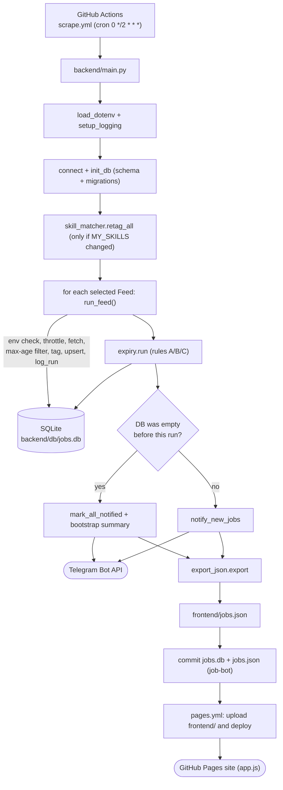

# Architecture

Job Radar is a free, self-running job aggregator. Every 2 hours a GitHub Actions
workflow runs a Python pipeline (`backend/main.py`). The pipeline scrapes 69 independent
**feeds**: free job APIs, ATS company boards, RSS/JSON feeds and India job sites.
Each feed turns its raw records into one `Job` schema through `normalize()`. The pipeline
then tags jobs with the user's skills, dedupes them into SQLite (`backend/db/jobs.db`,
committed to git), flags expired postings, sends Telegram alerts for new matches, and exports
`frontend/jobs.json`. A static vanilla-JS site in `frontend/` reads that file and is
deployed to GitHub Pages. For the reasons behind each design choice, see
[PROGRESS.md](PROGRESS.md), the authoritative decision log.



---

## 1. Pipeline stages (`backend/main.py`)

Run it from `backend/` (`python main.py [flags]`). The stages run in this order:

| # | Stage | What happens |
|---|---|---|
| 1 | `parse_args` | Flags: `--list --only --skip --group --skip-group --no-notify --no-export --ignore-throttle --test-telegram --db`. |
| 2 | `load_dotenv()` | Reads `KEY=VALUE` lines from `backend/.env`, then `<repo>/.env`, using `os.environ.setdefault`, so real env vars win. Quotes are stripped. |
| 3 | `setup_logging()` | INFO to stdout (forced to UTF-8) and to `backend/logs/run.log`. `urllib3` and `asyncio` are quieted. |
| 4 | `--test-telegram` | Sends one message and exits (0 = sent, 1 = not configured or failed). |
| 5 | Feed selection | `select_feeds(all_feeds(), only, group, skip_group, skip)`. `--only`/`--skip` match the exact feed name or the prefix before `:` (`greenhouse` matches every `greenhouse:*`). With `--list`, prints the feeds and exits 0. |
| 6 | DB open | `connect(args.db)` + `init_db` (runs the DDL and adds missing columns). `run_id = UTC %Y%m%dT%H%M%SZ`. `was_empty` is recorded here. |
| 7 | `retag_all(conn)` | Runs **before** scraping, and only if the `MY_SKILLS`/`SKILL_ALIASES` fingerprint changed (see §5). |
| 8 | `run_feed()` per feed | Runs sequentially and never raises. Details below. |
| 9 | `print_summary` | One line per feed (found / new / ok / ERROR / skipped), plus totals. |
| 10 | Expiry | `expiry.run(conn, succeeded)`. `succeeded` = `complete` feeds that ran with no error and `found > 0`. |
| 11 | Bootstrap or notify | If the DB was empty before this run and now has rows, `mark_all_notified` runs (no alerts), plus `send_bootstrap_summary` unless `--no-notify`. Otherwise `notify_new_jobs` runs unless `--no-notify`. |
| 12 | Export | `export_json.export(conn)` unless `--no-export`. Exceptions are logged and don't fail the run. |
| 13 | Exit code | `1` if at least one feed ran and **every** feed that ran has an error and 0 jobs found. Otherwise `0` (including when all feeds were skipped). |

**`run_feed(conn, feed, run_id, ignore_throttle)`**
1. Checks `feed.requires_env`. If any variable is empty, the feed is skipped (`missing env ...`) and nothing is logged to `scrape_runs`.
2. Checks the throttle. If `min_interval_hours` is set and `--ignore-throttle` isn't, and the last **successful** run (`scrape_runs.error IS NULL`) was less than that many hours ago, the feed is skipped (`throttled`) and nothing is logged.
3. Calls `feed.fetch()`. A `PartialResult` keeps its jobs and sets `error = "partial: ..."`. Any other exception sets `error = "Type: msg"` (≤500 chars) and saves no jobs.
4. Applies the max-age filter. If `feed.max_age_days` is set, jobs whose `posted_date` is older than now minus that many days are dropped (an ISO string comparison). Jobs with no date are kept.
5. For each remaining job: sets `job.feed = feed.name`, calls `skill_matcher.tag_job(job)`, and dedupes within the batch by `job_id`.
6. Calls `upsert_jobs(conn, jobs, seen_at=started_at)` in one transaction. A DB error becomes the feed's error.
7. Calls `log_run(...)` to write one `scrape_runs` row. It is written even when the feed failed.

---

## 2. Core concepts

### Feed (`scrapers/base.py`)

A Feed is one independently run scrape unit. A failure in one feed never affects another.

| Field | Meaning |
|---|---|
| `name` | Unique ID, e.g. `remoteok`, `greenhouse:stripe`, `internshala:jobs`. `all_feeds()` raises on duplicates. Stored in `jobs.feed` and `scrape_runs.source`. |
| `source` | Display name stored in `jobs.source` (`"Greenhouse"`). Shown on the site. |
| `group` | `api` \| `ats` \| `rss` \| `india`. Used by `--group` / `--skip-group`. |
| `fetch` | `Callable[[], list[Job]]`. It may raise, or raise `PartialResult`. |
| `min_interval_hours` | Throttle. `0` means every run. |
| `requires_env` | Tuple of env var names. The feed is skipped if any is missing. |
| `complete` | `True` when one fetch returns **every** open job of the source (ATS boards). Enables expiry rule B. |
| `max_age_days` | Drops jobs posted longer ago than this. Defaults to `settings.MAX_JOB_AGE_DAYS` (60). `None` keeps all (ATS). |

`registry.MODULES = ["scrapers.apis", "scrapers.ats", "scrapers.rss", "scrapers.india_boards"]`.
Each module exposes `feeds() -> list[Feed]`. If a module fails to import, it is logged and skipped.

### PartialResult

`PartialResult(jobs, reason)` is raised when some jobs were collected before an error
(for example, page 3 failed). The jobs are saved, but the run gets a non-NULL `error`.
That run then doesn't count as a success for the throttle or for expiry rule B, so
missing jobs are never treated as removed.

### HttpClient (`scrapers/base.py`)

- A `requests.Session` with urllib3 `Retry(total=3, backoff_factor=1.5)` on 429/500/502/503/504, for GET and POST, honouring `Retry-After`.
- An extra loop of 3 attempts on `ChunkedEncodingError` / `ConnectionError`, including drops mid-body. `resp.content` is read inside the loop. Then `raise_for_status()`.
- A random realistic User-Agent (`USER_AGENTS`) and `Accept-Language` on every request. Caller headers are merged on top.
- `delay_range=(lo, hi)`: waits a random time since the previous request of **this** client. `None` means no delay.
- `respect_robots=True`: calls `allowed(url)` before each request and raises `RobotsDisallowed` if blocked. `robots.txt` is cached per host. A 404 allows everything. Any other non-OK status or a network error disallows everything. The generic `*` group is used (`RobotsRules.can_fetch("*", url)`).
- `get`, `get_json` (adds `Accept: application/json`), `post_json`. Timeout: `settings.HTTP_TIMEOUT`.
- Create one client per feed or listing; don't share clients across feeds.

`scrapers/robots.py`: an RFC 9309 parser with `*` and `$` wildcards. The longest matching rule wins, and Allow wins ties.

### `normalize()` contract (`scrapers/normalize.py`)

It takes keyword-only arguments: `title, company, apply_link, source` (required), plus `location, description,
salary, posted, deadline, tags, type_hints, remote, job_type`. It returns a `Job`, or `None` when the
title is empty or `apply_link` doesn't start with `http://`/`https://`. Callers must skip `None`.

- HTML and entities are stripped (`clean_text`) and whitespace is collapsed. An empty company becomes `"Unknown"`.
- `remote=True` with no location sets `location = "Remote"`.
- `posted`: ISO, free-form, epoch s/ms, `"3 days ago"`, `today`, `yesterday` → ISO-8601 UTC (`to_iso`), or `None`.
- `deadline`: strips prefixes like "Apply by" or "Last date" → `YYYY-MM-DD`, or `None`.
- `job_type` (unless given) = `classify_job_type(title, hints, remote, location)`. It is always `tech` or `non-tech` (whole-word match of `TECH_KEYWORDS` on title + hints), plus `internship` (`INTERN_KEYWORDS`) and `remote` (when `remote is True`, or `remote is None` and `REMOTE_KEYWORDS` matches location + hints). `hints = type_hints + tags`.
- `description` is truncated to `DESCRIPTION_MAX_CHARS` on a word boundary, with `…` appended.
- `job.match_text = title + hints + full description`. It isn't stored, and the skill matcher uses it.
- Helpers: `format_salary(min, max, currency, period)` → `"USD 100,000 – 150,000 / year"`, `clean_text`, `truncate`.

### job_id

`make_job_id(company, title, apply_link)` = first 32 hex characters of
`sha256("company|title|apply_link")`, where each part is stripped and lower-cased. It is computed in
`Job.__post_init__`. The same posting found by two feeds with identical company, title and link is stored once.
The later feed's name overwrites `jobs.feed`.

---

## 3. Data model (`db/models.py`, `db/db.py`)

### `jobs`

| Column | Meaning |
|---|---|
| `job_id` (PK) | Hash described above |
| `title`, `company`, `location` | Cleaned text |
| `job_type` | Comma-separated: `tech`\|`non-tech` [,`internship`] [,`remote`] |
| `description` | Plain text, truncated to `DESCRIPTION_MAX_CHARS` |
| `skills_tags` | Comma-separated matched skills (lower-case, `MY_SKILLS` order) |
| `salary` | Free text |
| `posted_date` | ISO-8601 UTC, or NULL |
| `deadline` | `YYYY-MM-DD` if stated explicitly, else NULL |
| `apply_link`, `source` | URL and display name |
| `status` | `active` / `expired` |
| `notified` | 0/1, prevents duplicate Telegram alerts |
| `last_seen_at` | Start time of the latest run in which the job appeared |
| `scraped_at` | First time the job was seen |
| `feed` | Feed that last found the job (used by expiry rule B). Added by migration. |

Indexes: `status`, `source`, `last_seen_at`, `(feed, last_seen_at)`.

### `scrape_runs`

One row per feed per run that wasn't skipped: `id`, `run_id`, `source` (**the feed name**),
`started_at`, `finished_at`, `jobs_found` (unique jobs after the max-age filter), `jobs_new`, and `error`
(NULL = full success; `partial: ...` for partial runs). Indexes: `run_id`, `(source, started_at)`.

### `meta`

A key/value store. Currently it holds only `skills_fingerprint`.

### Migrations

`SCHEMA` uses `CREATE TABLE/INDEX IF NOT EXISTS`. `MIGRATIONS = [(table, column, type), ...]`.
On every run, `init_db` checks `PRAGMA table_info` and runs `ALTER TABLE ... ADD COLUMN` for any
missing column, then creates `CREATE_FEED_INDEX`, which depends on the migrated `feed` column.
Older `jobs.db` files upgrade in place.

### Upsert rules (`upsert_job`)

| On re-sighting (row exists) | Behaviour |
|---|---|
| `last_seen_at` | Set to the run's `started_at` |
| `status` | Set to `active` (reactivation). Rule A re-expires a job whose deadline has passed in the same run. |
| `feed`, `skills_tags` | Always overwritten |
| `description`, `salary`, `location` | Overwritten only if the new value is non-empty |
| `deadline` | Overwritten only if the new value is not NULL |
| `posted_date` | Filled only if currently NULL |
| `title`, `company`, `apply_link`, `source`, `job_type`, `notified`, `scraped_at` | **Never changed** |

A new row is inserted with `notified=0` and `last_seen_at = scraped_at = seen_at`. Rows are never deleted.

---

## 4. Expiry (`expiry/checker.py`)

The checker runs after scraping. It only ever sets `status='expired'` on active rows.

| Rule | Applies to | Condition |
|---|---|---|
| **A. Deadline** | All jobs | `deadline` is not empty and `deadline < today (UTC, YYYY-MM-DD)` |
| **B. Disappearance** | Jobs of `complete` feeds that succeeded **this run** | Let `T` = `started_at` of the feed's N-th most recent run with `error IS NULL AND jobs_found > 0` (N = `EXPIRY_MISSED_RUNS` = 2). Expire the feed's active jobs with `last_seen_at < T`. If there are fewer than N such runs, nothing happens. |
| **C. Staleness** | All jobs (the main rule for non-complete feeds; a fallback for removed or broken ATS feeds) | `last_seen_at < now - WINDOW_FEED_STALE_DAYS` (21 days) |

Failed, partial, zero-result and throttled or skipped runs never count toward rule B,
so an outage can't mass-expire jobs. The run logs the counts per rule and the active/expired totals.

---

## 5. Skills and notifications

**Skill tagging** (`filters/skill_matcher.py`, config in `filters/skills_config.py`)
- `MY_SKILLS` plus `SKILL_ALIASES` are compiled into whole-word, case-insensitive regexes. Spaces and hyphens inside a term match each other. A match on an alias tags the main skill.
- `tag_job(job)` uses `job.match_text` (full text). `retag_all` uses the stored title + job_type + truncated description.
- The fingerprint is the SHA-1 of the JSON of `[MY_SKILLS, SKILL_ALIASES]`, stored in `meta`. When it changes, every row is re-tagged.
- An empty `MY_SKILLS` means `skills_filter_active()` is False and every job counts as a match.

**Telegram** (`notifier/telegram.py`, env `TELEGRAM_TOKEN`, `TELEGRAM_CHAT_ID`)

Candidates: `notified = 0 AND status = 'active' AND (posted_date IS NULL OR posted_date >= now - NOTIFY_MAX_AGE_DAYS)`,
plus non-empty `skills_tags` when the skill filter is active. They are ordered newest first
by `COALESCE(posted_date, scraped_at)`.

Spam guards and behaviour:
- **First run** (empty DB): every job is marked notified. At most one "set up" summary message is sent.
- At most `MAX_NOTIFICATIONS_PER_RUN` (25) individual messages, 1.1 s apart. The rest go into one "N more" message, with a `SITE_URL` link if set, and are marked notified only if that message was sent.
- Only jobs whose message was sent successfully are marked `notified=1`.
- If Telegram isn't configured, a warning is logged, nothing is marked, and the alerts go out on a later configured run (still subject to the age window).
- `send_message` uses HTML parse mode with escaped fields and no link previews. It makes up to 4 attempts, sleeps for `retry_after` on a 429, and never logs the token.
- Message: title, company, location, job_type, source, skills, optional salary and deadline, and an Apply link.

---

## 6. `jobs.json` and the website

**Writer:** `exporter/export_json.py` → `frontend/jobs.json`. The write is atomic (`.json.tmp` + `os.replace`).
The file contains all active jobs plus expired jobs with `last_seen_at` within `EXPORT_EXPIRED_DAYS`. Jobs are ordered by
`COALESCE(posted_date, scraped_at) DESC, job_id`, one job per line (for small git diffs).

| Top-level key | Content |
|---|---|
| `generated_at` | ISO UTC |
| `counts` | `{active, expired, exported}` (active/expired are DB totals) |
| `my_skills` | Lower-cased `MY_SKILLS` |
| `all_skills` | Sorted set of tags present in exported jobs |
| `sources` | One entry per display source: `{source, feeds, ok, failed, last_run, jobs_active, errors[]}`, built from each feed's latest `scrape_runs` row; sorted by `jobs_active` desc |
| `jobs` | Array of job objects (below) |

Job object keys (empty, null and `[]` values are **omitted**): `id`, `title`, `company`, `location`,
`job_type` (array), `skills` (array), `salary`, `posted`, `deadline`, `apply_link`, `source`,
`status`, `first_seen` (date of `scraped_at`), `last_seen` (date; expired jobs only),
`snippet` (description truncated to `EXPORT_SNIPPET_CHARS`).

**Reader:** `frontend/app.js` (plain JS, no build, no dependencies). It fetches `jobs.json?v=<10-minute bucket>` once
and filters everything client-side.

| Filter | Semantics |
|---|---|
| Window `24` / `48` (default) / `all` | `_posted` ≥ now − N hours. `_posted` = `posted`, falling back to `first_seen`. |
| Search `q` | Every whitespace-separated term must be a substring of lower-case `title + company` |
| Skills chips | OR: the job has **any** selected skill. Chips list `my_skills` first, then `all_skills`. Counts are over active jobs. |
| Type chips | `tech`/`non-tech` are OR'ed with each other; `internship`/`remote` are AND'ed |
| Location `loc` | Substring of lower-case location |
| Source | Exact match on `source` |
| Include expired | Off means only `status === "active"` |
| Sort | `newest` (by `_posted` desc) or `deadline` (soonest first; no deadline sorts last; ties by newest) |

- **URL state:** `?q=&window=&skills=a,b&types=&loc=&source=&sort=deadline&expired=1`. Only non-default values are written, via `history.replaceState`, and they are restored on load. Invalid `window`/`types` values are ignored.
- **Infinite scroll:** cards are rendered 60 at a time (`PAGE_SIZE`). An `IntersectionObserver` on `#sentinel` (rootMargin 800px) triggers more. After each batch it keeps filling while the sentinel is near the viewport. Without IntersectionObserver, everything is rendered.
- Safety: all text is set via `textContent`, and `safeUrl()` allows only http/https apply links.
- Extras: a deadline shows red within 3 days, the "Source status" table comes from `sources`, and `/` focuses search.

**Deploy:** `.github/workflows/pages.yml` uploads `frontend/` with `actions/upload-pages-artifact`
and deploys it with `actions/deploy-pages`. It is triggered by `workflow_call` (from scrape.yml), by a push to `main` touching
`frontend/**`, or manually. It checks out `github.ref_name`, so it includes the data commit that was just pushed.

---

## 7. Source catalogue

Method key: **API** = JSON API, **ATS** = company board API/feed, **RSS** = feed via feedparser,
**HTML** = server-rendered page + BeautifulSoup, **PW** = Playwright headless Chromium.
"Robots" means `respect_robots=True`. The default max age is 60 days unless noted.

| Feed name(s) | Module | Method | Key needed? | complete? | Throttle | Notes |
|---|---|---|---|---|---|---|
| `remoteok` | apis | API | no | no | every run | Single request; skips the legal-notice element; link back required |
| `remotive` | apis | API | no | no | 6 h | Terms ask for ≤ ~4 calls/day |
| `himalayas` | apis | API | no | no | every run | Cursor pagination, 20/page, `API_MAX_PAGES`; `expiryDate` → deadline |
| `jobicy` | apis | API | no | no | every run | `count=100` |
| `arbeitnow` | apis | API | no | no | every run | 2 pages; mostly Europe |
| `themuse` | apis | API | optional `MUSE_API_KEY` | no | every run | Locations India + Flexible/Remote; up to `API_MAX_PAGES`; relies on max-age filter |
| `jooble` | apis | API (POST) | `JOOBLE_KEY` | no | 4 h | `SEARCH_QUERIES` × 2 pages, `JOOBLE_LOCATION` |
| `adzuna` | apis | API | `ADZUNA_APP_ID`, `ADZUNA_APP_KEY` | no | 6 h | `SEARCH_QUERIES` × `ADZUNA_PAGES_PER_QUERY`, `ADZUNA_COUNTRY`, `max_days_old=7` |
| `findwork` | apis | API | `FINDWORK_TOKEN` | no | every run | Follows `next` links, `API_MAX_PAGES` |
| `greenhouse:<slug>` ×20 | ats | ATS | no | **yes** | every run | `content=true`; `application_deadline` → deadline; max age off |
| `lever:<slug>` ×9 | ats | ATS | no | **yes** | every run | Company name derived from slug; max age off |
| `ashby:<slug>` ×9 | ats | ATS | no | **yes** | every run | Skips `isListed=false`; compensation summary as salary; max age off |
| `smartrecruiters:<Slug>` ×5 | ats | ATS | no | **yes** | every run | 100/page, max 10 pages, then `PartialResult`; no descriptions; max age off |
| `breezy:<slug>` ×4 | ats | ATS | no | **yes** | every run | `<slug>.breezy.hr/json`; no descriptions; max age off |
| `teamtailor:<slug or host>` ×4 | ats | ATS (RSS) | no | **yes** | every run | Public `jobs.rss` (the JSON API needs a per-company key); max age off |
| `weworkremotely` | rss | RSS | no | no | every run | Robots; "Company: Title" split; `expires_at` → deadline |
| `jobspresso` | rss | RSS | no | no | every run | Robots; `/jobs/feed/` (URLs with `?` are disallowed); 3–4 s delay (Crawl-delay 3) |
| `workingnomads` | rss | API (JSON feed) | no | no | every run | Robots; the site no longer has RSS |
| `internshala:internships`, `internshala:jobs` | india_boards | HTML | no | no | 4 h | Robots, 2–5 s delay; category slugs × `/page-N/` up to `INDIA_MAX_PAGES` |
| `shine` | india_boards | HTML (embedded `__NEXT_DATA__` JSON) | no | no | 4 h | Robots, 2–5 s; `INDIA_QUERIES`; `jExpDate` → deadline; recruiter contact ignored |
| `freshersworld` | india_boards | HTML | no | no | 4 h | Robots, 2–5 s; 5 category pages, no pagination (robots) |
| `naukri` | india_boards | PW | no | no | 4 h | Robots enforced in the browser; never test-run; may hit bot protection |
| `foundit` | india_boards | PW | no | no | 4 h | Currently fails with `SiteBlocked` (bot protection) |

Totals: 9 API + 51 ATS + 3 RSS + 6 India = **69 feeds**. The company slugs are in `backend/config/companies.py`.
API feeds use `ApiPuller`'s default delay of 0.5–1.0 s and ATS feeds use `ATS_DELAY_RANGE`. Neither checks robots.txt.

---

## 8. Extension recipes

### Add a JSON API (`scrapers/apis.py`)

```python
def _example_requests() -> RequestGen:
    for page in range(1, settings.API_MAX_PAGES + 1):
        data = yield {"url": "https://example.com/api/jobs", "params": {"page": page}}
        if not (data or {}).get("next"):
            return


def _map_example(item: dict) -> Optional[Job]:
    return normalize(
        title=item.get("title"),
        company=item.get("company"),
        apply_link=item.get("url"),
        source="Example",
        location=item.get("location") or "",
        description=item.get("description"),
        posted=item.get("published_at"),
        tags=item.get("tags") or [],
        remote=bool(item.get("remote")) or None,
    )


example = ApiPuller("example", _example_requests, lambda d: d.get("jobs", []), _map_example)

# in feeds():
Feed("example", "Example", "api", example.fetch, requires_env=("EXAMPLE_KEY",)),  # key optional
```

Use `single(url, params=...)` for a single request. For a POST, yield `{"url", "method": "POST", "json": {...}}`.
A secret must be read with `os.environ.get(...)`, listed in `requires_env`, added to `.env.example`, and
passed in the `env:` block of `scrape.yml`.

### Add an ATS platform (`scrapers/ats.py`)

```python
def exampleats(slug: str) -> list[Job]:
    data = _client().get_json(f"https://example-ats.com/api/{slug}/jobs")
    jobs = []
    for item in data.get("jobs", []):
        job = normalize(title=item.get("title"), company=slug.title(),
                        apply_link=item.get("url"), source="ExampleATS",
                        location=item.get("location") or "", description=item.get("description"),
                        posted=item.get("published"), remote=_is_remote(item.get("location")))
        if job:
            jobs.append(job)
    return jobs

PLATFORMS["exampleats"] = ("ExampleATS", exampleats)   # or add to the dict literal
```

Then add `"exampleats": ["slug1", ...]` to `COMPANIES` in `config/companies.py`. `feeds()` creates
`exampleats:<slug>` feeds with `complete=True, max_age_days=None`. The fetch function must return the
**entire** board, or raise `PartialResult` if it can't, because rule B depends on that.
Test with `python main.py --only exampleats --no-notify --no-export --db <temp>`.

### Add an HTML scraper (`scrapers/india_boards.py` or a new module)

```python
def _parse_example(html: str) -> list[Job]:
    soup = BeautifulSoup(html, "html.parser")
    jobs = []
    for card in soup.select(".job-card"):
        link = card.select_one("a.title")
        if not link:
            continue
        job = normalize(title=link.get_text(" ", strip=True),
                        company=_text(card, ".company"),
                        apply_link=urljoin("https://example.in/", link.get("href", "")),
                        source="Example", location=_text(card, ".location"),
                        posted=_text(card, ".posted") or None)
        if job:
            jobs.append(job)
    return jobs


def fetch_example() -> list[Job]:
    def listing(query: str):
        def crawl():
            client = _client()          # 2–5 s delays + robots.txt enforced
            base = f"https://example.in/{_slug(query)}-jobs"
            urls = [base] + [f"{base}/page-{n}" for n in range(2, settings.INDIA_MAX_PAGES + 1)]
            return paginate(urls, lambda u: _parse_example(_html(client, u)))
        return crawl
    return run_many([listing(q) for q in settings.INDIA_QUERIES])

# in feeds():
Feed("example", "Example", "india", fetch_example, min_interval_hours=every),
```

Rules: always use `_client()` (`respect_robots=True`, `SCRAPE_DELAY_RANGE`). Check that the listing
URLs are allowed by robots.txt. Never try to bypass a 403 or bot protection; let the feed fail.
For JS-rendered sites, use `with Browser("host") as browser: browser.html(url, selector)`.
A new module must be added to `registry.MODULES` and expose `feeds()`.

### Add a column

1. Add it to the `CREATE TABLE jobs` in `SCHEMA` (for new DBs).
2. Append `("jobs", "new_col", "TEXT")` to `MIGRATIONS` (for the existing committed DB).
3. Add the field to the `Job` dataclass, and include it in the `INSERT` and (if wanted) `UPDATE` in `db.upsert_job`. Choose whether to always overwrite or use `COALESCE(NULLIF(?, ''), col)`.
4. Optionally export it in `_job_rows` / `_job_dict` and use it in `app.js`.

### Change the schedule

Edit `cron` in `.github/workflows/scrape.yml` (UTC) and update `SCRAPE_INTERVAL_HOURS` in
`config/settings.py` to match. The Python code doesn't read that value; it documents
the schedule. Also consider the per-feed `min_interval_hours` values, the Actions minutes budget (~6 min per run),
and the "refreshes every 2 hours" text in `app.js`.

---

## 9. Configuration reference

### `backend/config/settings.py`

| Setting | Default | Effect |
|---|---|---|
| `SCRAPE_INTERVAL_HOURS` | `2` | Documentation only; keep it in sync with the cron |
| `EXPIRY_MISSED_RUNS` | `2` | Rule B: N successful runs a job must be missing from |
| `MAX_JOB_AGE_DAYS` | `60` | Default `Feed.max_age_days`; older postings are dropped at ingest |
| `WINDOW_FEED_STALE_DAYS` | `21` | Rule C: expire when not seen for this long |
| `DESCRIPTION_MAX_CHARS` | `800` | Stored description length |
| `EXPORT_SNIPPET_CHARS` | `160` | `snippet` length in jobs.json |
| `EXPORT_EXPIRED_DAYS` | `60` | Expired jobs last seen within this window are exported |
| `MAX_NOTIFICATIONS_PER_RUN` | `25` | Individual Telegram messages per run; the rest are summarised |
| `NOTIFY_MAX_AGE_DAYS` | `7` | Don't alert for jobs posted earlier than this |
| `SITE_URL` | env `SITE_URL` or `""` | Link in summary and bootstrap messages |
| `SEARCH_QUERIES` | `["software developer", "python developer", "data analyst"]` | Adzuna and Jooble keywords |
| `INDIA_QUERIES` | `["python", "software developer", "data analyst"]` | Shine, Naukri and Foundit keywords |
| `ADZUNA_COUNTRY` | env or `"in"` | Adzuna country path and currency label |
| `ADZUNA_PAGES_PER_QUERY` | `2` | Adzuna pages (50 each) per query |
| `JOOBLE_LOCATION` | env or `"India"` | Jooble search location |
| `API_MAX_PAGES` | `5` | Page cap for Himalayas, The Muse and Findwork |
| `INDIA_MAX_PAGES` | `2` | Page cap per India listing |
| `SCRAPE_DELAY_RANGE` | `(2.0, 5.0)` | Seconds between HTML/browser requests |
| `ATS_DELAY_RANGE` | `(0.3, 0.8)` | Seconds between ATS requests |
| `HTTP_TIMEOUT` | `30` | Request timeout (s) |

`settings` is imported (via `main.py`'s imports) **before** `load_dotenv()` runs. As a result,
`SITE_URL`, `ADZUNA_COUNTRY` and `JOOBLE_LOCATION` are picked up only from the real
environment, not from a local `.env`. Keys read at call time (API keys, Telegram) do work from `.env`.

Other module-level knobs: `INTERNSHALA_INTERNSHIPS`, `INTERNSHALA_JOBS`, `FRESHERSWORLD_CATEGORIES`,
`INDIA_FEED_INTERVAL_HOURS = 4` (`india_boards.py`); `MUSE_LOCATIONS` (`apis.py`);
`SMARTRECRUITERS_PAGE/_MAX_PAGES` (`ats.py`); `SEND_INTERVAL = 1.1` (`telegram.py`);
`MY_SKILLS`, `SKILL_ALIASES` (`filters/skills_config.py`); `COMPANIES` (`config/companies.py`).

### Environment variables, secrets and repo variables

| Name | Kind in GitHub | Used by | Required? |
|---|---|---|---|
| `TELEGRAM_TOKEN` | Secret | notifier | For alerts |
| `TELEGRAM_CHAT_ID` | Secret | notifier | For alerts |
| `ADZUNA_APP_ID`, `ADZUNA_APP_KEY` | Secret | `adzuna` feed | Optional (feed skipped) |
| `JOOBLE_KEY` | Secret | `jooble` feed | Optional (feed skipped) |
| `FINDWORK_TOKEN` | Secret | `findwork` feed | Optional (feed skipped) |
| `MUSE_API_KEY` | Secret | `themuse` feed | Optional (only raises the rate limit) |
| `SITE_URL` | Variable | settings → Telegram links | Optional |
| `ADZUNA_COUNTRY` | Variable (workflow default `in`) | settings | Optional |
| `JOOBLE_LOCATION` | Variable (workflow default `India`) | settings | Optional |
| `ONLY`, `NOTIFY` | Workflow-internal | scrape.yml shell step → `--only`, `--no-notify` | Set from `workflow_dispatch` inputs `only` / `notify` (scheduled runs always notify) |

Locally, copy `.env.example` to `.env` (git-ignored).

### Workflows

- **`scrape.yml`**: triggered by cron `0 */2 * * *` and `workflow_dispatch` (inputs `only`, `notify`). Permissions: `contents`/`pages: write`, `id-token: write`. It uses concurrency group `job-scraper` (no cancel) and a 45-minute timeout. Steps: Python 3.11 with pip cache → `pip install -r backend/requirements.txt` → `playwright install --with-deps chromium` → `python main.py` → upload `run.log` (7 days) → commit `jobs.db` + `jobs.json` as `job-bot` (on `!cancelled()`, with pull --rebase and 3 retries) → `deploy` job calls `pages.yml`.
- **`pages.yml`**: see §6. It uses concurrency group `pages` (cancel in progress).

Dependencies (`backend/requirements.txt`): `requests`, `beautifulsoup4`, `python-dateutil`,
`feedparser`, `playwright`. The Playwright import is lazy, used only by Naukri and Foundit.
